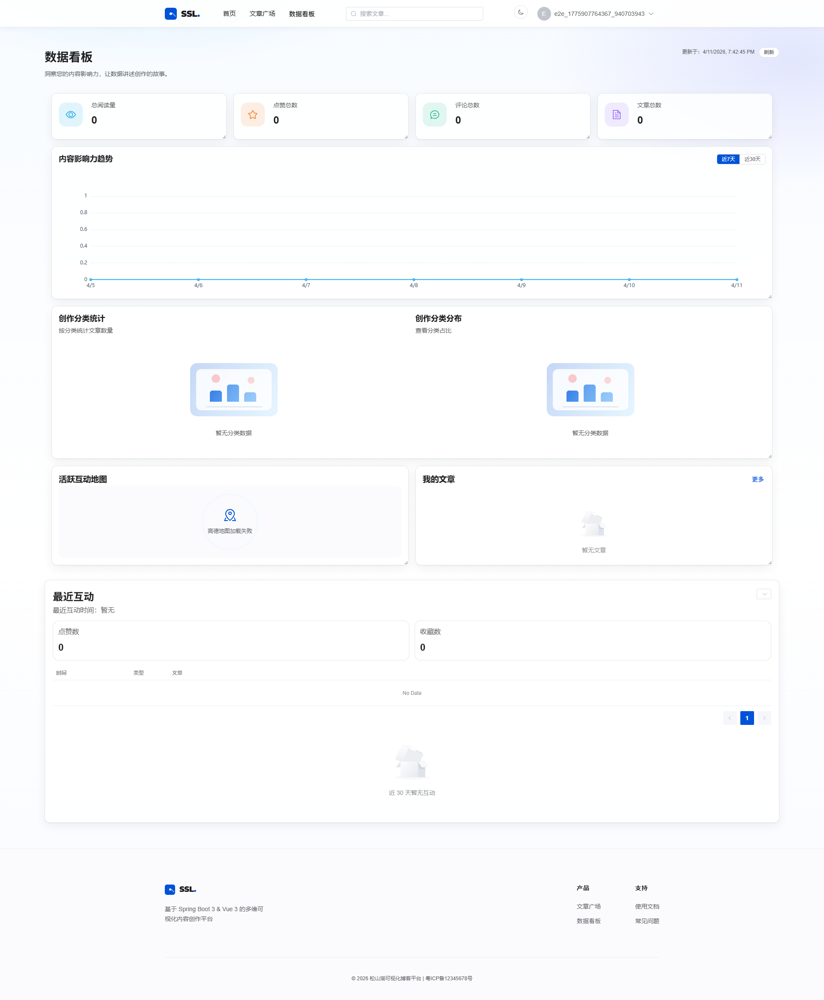
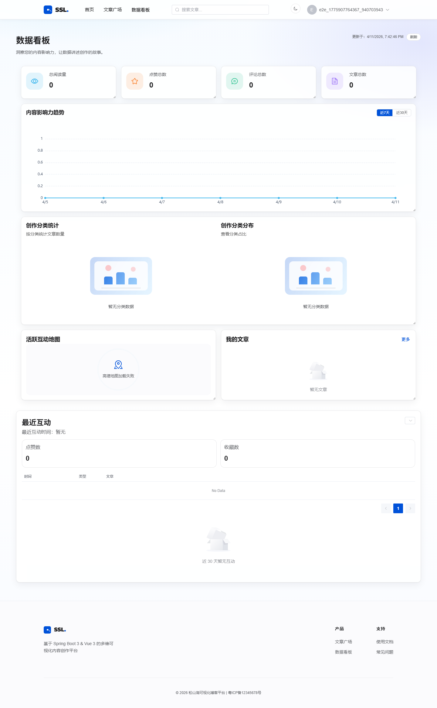
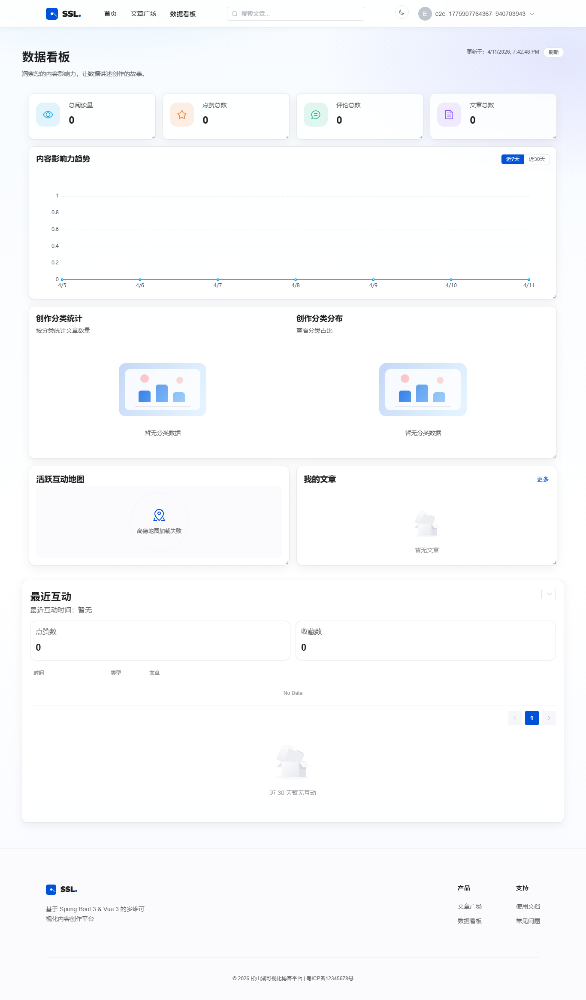
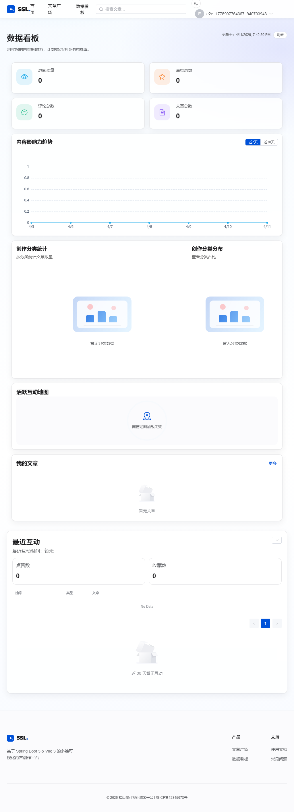
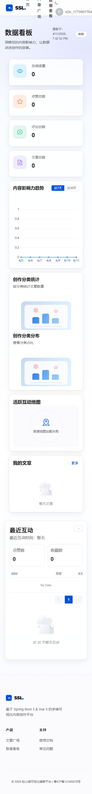
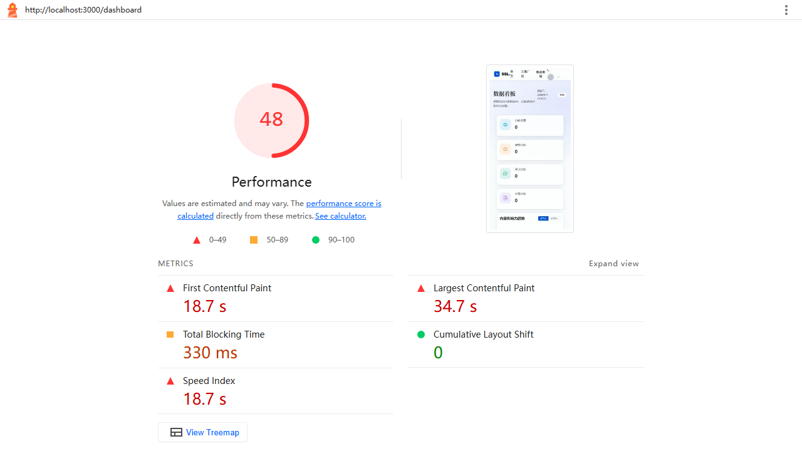

# 数据看板视觉走查报告

生成时间：2026/4/11 19:42:44

## 多分辨率截图与指标

### 1920x1080

- 截图：
- 横向滚动条：无（通过）
- category 容器 offsetWidth/offsetHeight：1678/354
- bar panel offsetWidth/offsetHeight：815/322
- pie panel offsetWidth/offsetHeight：815/322
- grid-template-columns：815px 815px
- min-inline-size：min(100%, 320px)
- max-inline-size：100%

### 1440x900

- 截图：
- 横向滚动条：无（通过）
- category 容器 offsetWidth/offsetHeight：1300/354
- bar panel offsetWidth/offsetHeight：626/322
- pie panel offsetWidth/offsetHeight：626/322
- grid-template-columns：626px 626px
- min-inline-size：min(100%, 320px)
- max-inline-size：100%

### 1366x768

- 截图：
- 横向滚动条：无（通过）
- category 容器 offsetWidth/offsetHeight：1229/354
- bar panel offsetWidth/offsetHeight：591/322
- pie panel offsetWidth/offsetHeight：591/322
- grid-template-columns：590.5px 590.5px
- min-inline-size：min(100%, 320px)
- max-inline-size：100%

### 1024x768

- 截图：
- 横向滚动条：无（通过）
- category 容器 offsetWidth/offsetHeight：942/478
- bar panel offsetWidth/offsetHeight：598/446
- pie panel offsetWidth/offsetHeight：299/446
- grid-template-columns：598.469px 299.25px
- min-inline-size：min(100%, 320px)
- max-inline-size：100%

### 375x667

- 截图：
- 横向滚动条：无（通过）
- category 容器 offsetWidth/offsetHeight：301/478
- bar panel offsetWidth/offsetHeight：269/217
- pie panel offsetWidth/offsetHeight：269/217
- grid-template-columns：269px
- min-inline-size：min(100%, 320px)
- max-inline-size：100%

## Lighthouse（CLS）

- CLS 评分：100
- CLS 数值：0
- 报告：./lighthouse/dashboard.report.html

- CLS 截图：
