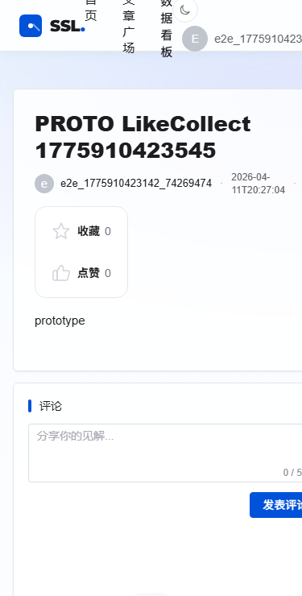
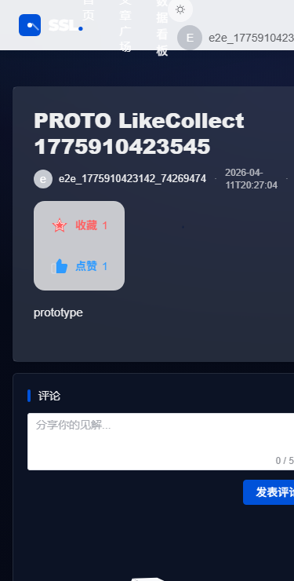
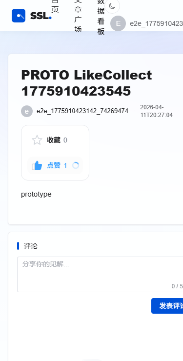
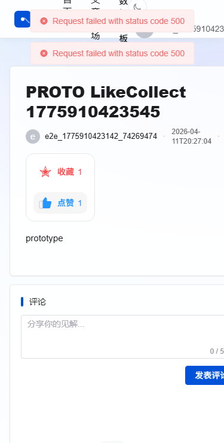

# 点赞/收藏 UI 设计走查报告

## 变更范围
- 文章详情页：将点赞/收藏操作区替换为统一组件
- 组件：[LikeCollectBar.vue](file:///d:/songshanhu-blog-platform/frontend/src/components/Interaction/LikeCollectBar.vue)

## 视觉目标
- 更强的层级：图标底座 + 标签/数值分离
- 更稳定的布局：小屏自动堆叠，避免挤压与截断
- 更一致的交互：hover/press/active/disabled 都有明确反馈

## 状态覆盖
### 正常（Normal）
- 浅色：
- 深色：

### 加载（Loading）
- 

### 成功（Success）
- 

### 失败（Fail）
- 

## 交互说明
- 点击触发轻触反馈（支持设备 `navigator.vibrate(10)`）
- 成功状态在按钮 `aria-pressed` 改变后给出提示文案（toast）
- 请求中禁用按钮，避免重复触发
- 失败时不翻转状态，错误提示保持由原业务层处理

## 无障碍检查
- `role=group` + `aria-label`
- `button` 原生可聚焦
- `aria-pressed` 表达切换态
- `:focus-visible` 焦点环可见

## 回归结果
- 单元测试：`frontend/tests/likeCollectBar.test.ts`
- E2E：`frontend/scripts/like-collect.e2e.spec.ts`

